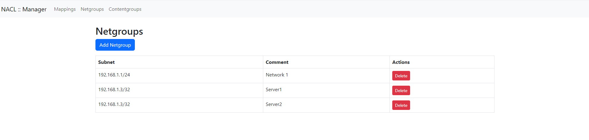
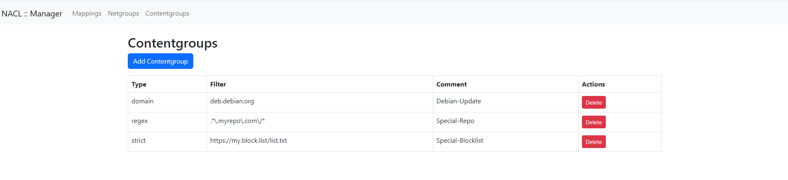
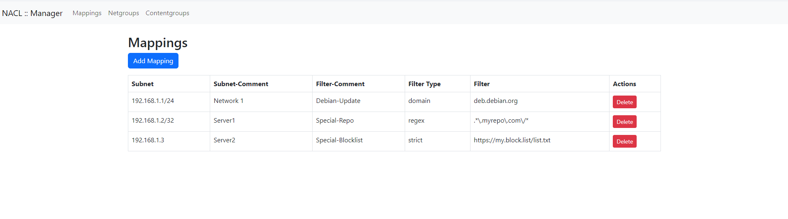

```
    oooo   oooo     o       oooooooo8 ooooo       
    8888o  88     888    o888     88  888        
    88 888o88    8  88   888          888        
    88   8888   8oooo88  888o     oo  888      o 
    o88o    88 o88o  o888o 888oooo88  o888ooooo88
        
            Squid Network ACL Control          
            Author: github.com/her-finn 
```
# About
NACL (*Network ACL Manager*) is a tool that is designed to easily manage squid ACLs. The focus is on ensuring that servers only get access to the URIs that they need.

The heart of the system is the Squid proxy, which receives all requests and forwards them to the NACL processor.
This processor looks for the guidelines that match the device and then accepts or rejects the connection if necessary.

You can define in so-called content groups which URIs can be accessed and then link them to individually created network objects.

__There are these 3 filter options:__
- __Strict__: Only the specified URI (such as: https://contoso.com/list.txt) can be accessed
- __Domain__: All URIs that are based on a specific domain (e.g. contoso.com) can be accessed
- __Regex__: Build your own filters and release several URIs at once





# Installation
## Requirements
- Debian 12 Server (or any other Server where Python3 and Squid can be installed on)
- Squid installed
- git
- Python3 Packges installed with pip
## Installation and Connection with Squid
### 1. Clone the repository to /nacl and cd into
```
git clone https://github.com/her-finn/squid-acl-manager.git /nacl
cd /nacl
```
### 2. Install required Python Packages
```
pip3 install -r requirements.txt
```
### 3. Initialize Database and test
```
python3 nacl-check.py
```
*Abort (STRG + c)*
and Check if Database was created
```
ls nacl.db
```
### 4. Make script executeable
```
chmod +x nacl-check.py
```
### 5. Adjust Squid config
```
vim /etc/squid/squid.conf
```
and add these Lines on top of the file to use nacl.py as acl manager
```
external_acl_type nacl children=5 ttl=60 %SRC %URI /nacl/nacl-check.py
acl nacl external nacl
http_access allow nacl
```
### 6. Restart Squid
```
systemctl restart squid
```

## Installation of Web-Management
### 1. Copy Systemd File
```
cp /nacl/nacl-manager-web.service /etc/systemd/system/nacl-manager-web.service
```
### 2. Reload Systemd
```
systemctl daemon-reload
```
### 3. Start + Enable Web-Frontend
```
systemctl enable --now nacl-manager-web
```

**Now youre able to Access Management UI via [http://localhost:5000](http://localhost:5000). If you want to Access to Management UI from Network (WHICH IS NOT RECOMMENDED, Just use a Reverse Proxy like nginx)**, change the /nacl/web/app.py like this:
```
vim /nacl/web/app.py
```
search for this line: `app.run(debug=False)` and change it:
```
app.run(Debug=False,host="0.0.0.0")
```
   
